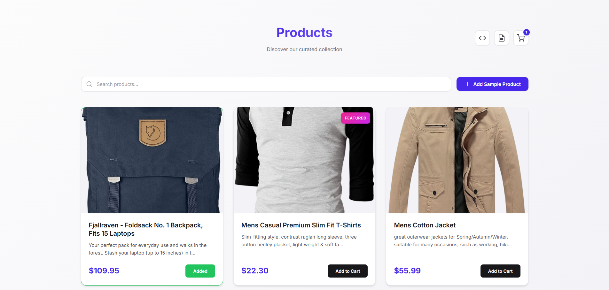
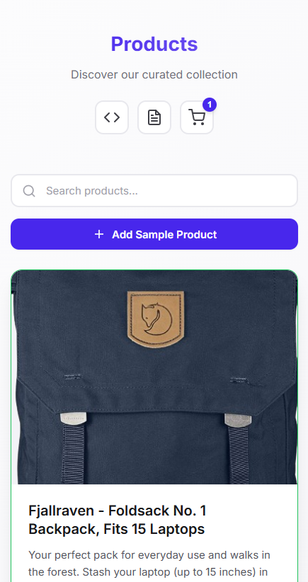

# Product Card Layout

A responsive product card grid with **real-time API integration**, built using mobile-first HTML/CSS and vanilla JavaScript.

## 🚀 Quick Start

### Option 1: Open Directly (Simple)
Open `index.html` in your browser

### Option 2: Local Server (Recommended)
```bash
# Start server (Python 3)
python3 -m http.server 8000

# Visit: http://localhost:8000
```

## 📸 Screenshots

### Web Version


### Mobile Version


## ✨ Features

### 🛍️ Live API Integration
- **FakeStore API**: Fetches real product data on page load
- **Dynamic Loading**: 20 products fetched, 3 displayed initially
- **Loading States**: Spinner animation during data fetch
- **Error Handling**: Error messages with retry functionality

### 📱 Responsive Design (Mobile-First)
- **Mobile** (<768px): 1 column (stacked)
- **Tablet** (≥768px): 2 columns  
- **Desktop** (≥1024px): 3 columns
- **Fluid images** and no horizontal scrolling

### 🛒 Shopping Cart
- **Cart Icon**: Header badge with live item counter
- **Side Modal**: Slide-in cart with blur overlay
- **Item Management**: View all added items with images, titles, prices
- **Remove Items**: Remove button synced with product cards
- **State Sync**: Cart and product cards stay in sync

### 🔍 Interactive Elements
- **Add to Cart**: Toggle between "Add to Cart" ↔ "Added" with visual feedback
- **Search Filter**: Real-time case-insensitive product search by title
- **Dynamic Cards**: "Add Sample Product" button fetches more from API
- **Smart Filtering**: Hide non-matching products dynamically (search)

## 📁 Project Structure

```
/
├── index.html              # Main HTML structure
├── styles.css              # Mobile-first responsive CSS
├── script.js               # Vanilla JavaScript 
└── README.md               # This file
```

## 🎯 Features Implemented

✅ **Part 1**: Mobile-first responsive grid with API-loaded products
✅ **Part 2**: Button toggle & search/filter functionality  
✅ **Part 3**: Dynamic product card creation from API  
✅ **Part 4**: Shopping cart with badge, modal, and item management  
✅ **Part 5**: FakeStore API integration


## 🎨 Design Highlights

- **Modern Design System**: CSS custom properties with vibrant HSL colors
- **Smooth Animations**: Fade-in cards, hover effects, slide-in modal
- **Premium Aesthetics**: Gradients, micro-interactions
- **Typography**: Inter font from Google Fonts
- **Accessibility**: ARIA labels, keyboard navigation, focus states

## 🌐 API Details

**Endpoint**: `GET https://fakestoreapi.com/products?limit=20`

**Data Mapping**:
- `title` → Product name
- `price` → Formatted as `$XX.XX`
- `description` → Truncated to 100 characters
- `image` → Product image URL
- `category` → Badge (New/Premium/Trending/Featured)

**Features**:
- ✅ Loading state with spinner
- ✅ Error handling with retry
- ✅ Data transformation and formatting
- ✅ Real-time product fetching

---

**Built using vanilla HTML, CSS, and JavaScript**
